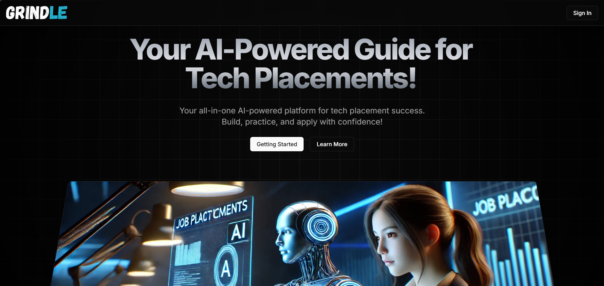
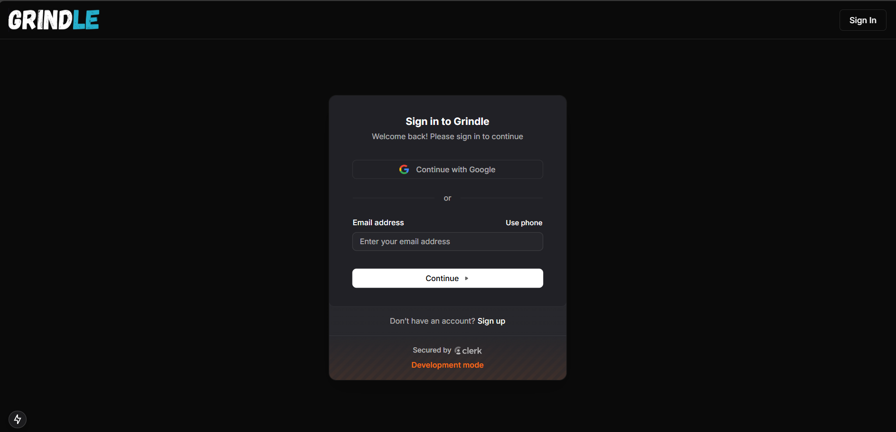
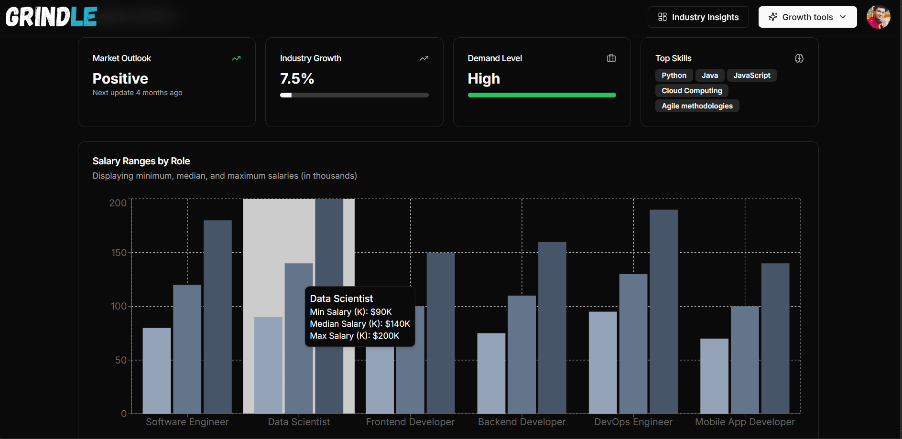
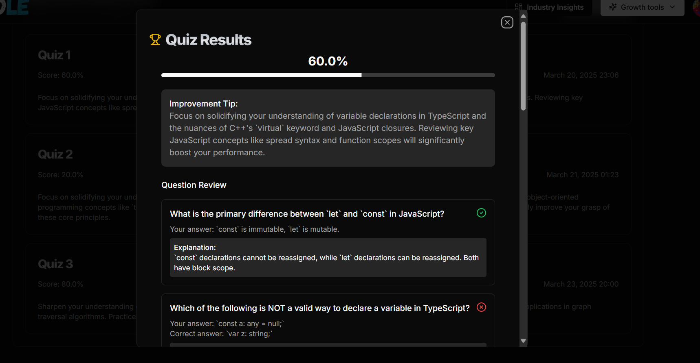
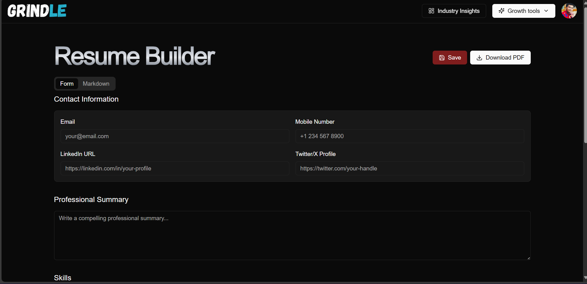
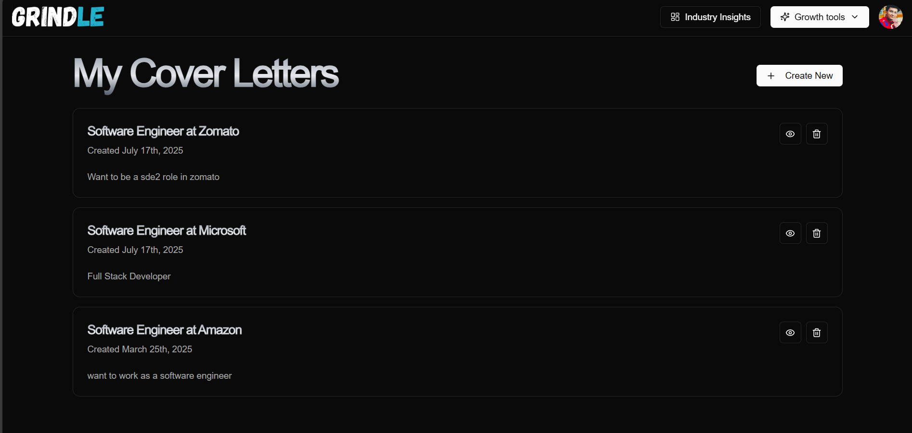

# 💼 Grindle – AI-Powered Job Preparation Platform

Grindle is a full-stack platform that simplifies and enhances job preparation for students and professionals. It offers personalized resume and cover letter generation using Gemini LLM, technical assessment preparation, and weekly-updated job market insights with automated analytics.

---

## 🎥 Project Demo

📺 ([https://your-demo-link.com](https://drive.google.com/file/d/1UVuUmQNVjwdEsNbxFK-IeEaupoVY2Yy8/view?usp=sharing))  

---

---

## 🚀 Key Features

### 🧠 AI Resume & Cover Letter Generator
- Generate tailored resumes and cover letters using **Gemini LLM**.
- Aligned to job descriptions and personalized with user data.
- Option to regenerate, edit, and download instantly.

### 📊 Technical Assessment Preparation
- Auto-generated quizzes for DSA, DBMS, React, and more.
- Instant scoring and improvement suggestions.
- Track user-specific progress over time.

### 📈 Weekly Job Market Insights
- Industry insights updated weekly using **Ingest** automation.
- View role-based salary ranges, demand levels, market trends, and skill gaps.
- Smart UI for digesting complex analytics visually.

### 🎥 Mock Interview System (Upcoming)
- Real-time video interviews between recruiter and candidate.
- Live coding window for solving problems during the interview session.
- Interviewers can rate performance and leave feedback.

---

## 🖼️ Screenshots

| Home | Authentication |
|----------------|-------------------|
|  |  |

| Industry Insights | Technical Quiz|
|----------------|-------------------|
|  |  | 

| Resume Generator | Cover Letter Generator |
|------------------|------------------------|
|  |  |

## 🧪 Tech Stack

| Layer        | Technologies                                                           |
|--------------|------------------------------------------------------------------------|
| Frontend     | Next.js (App Router), React, TypeScript, Tailwind CSS, Lucide Icons    |
| Backend      | Node.js, Prisma ORM, REST APIs                                         |
| Database     | PostgreSQL via NeonDB                                                  |
| AI Services  | Gemini LLM (Resume & Cover Letter)                                     |
| Automation   | Ingest (Industry Insight Updater)                                      |

---

